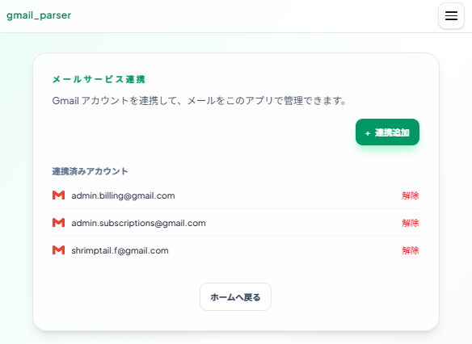
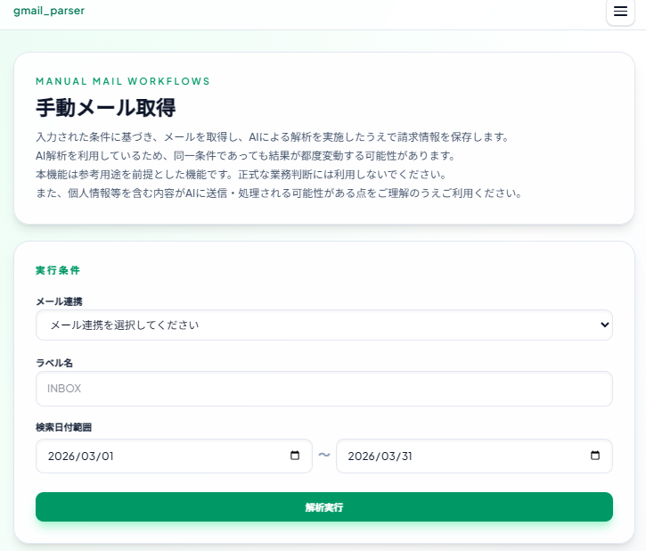
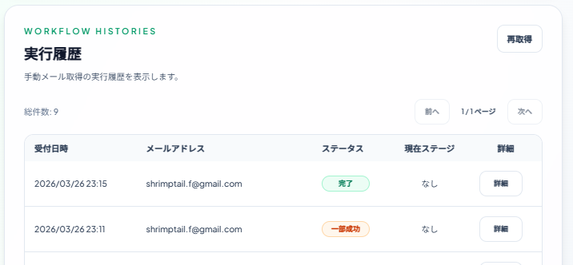
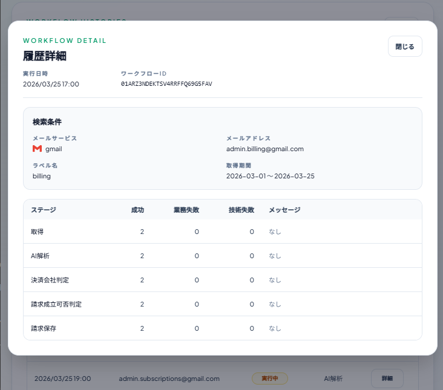
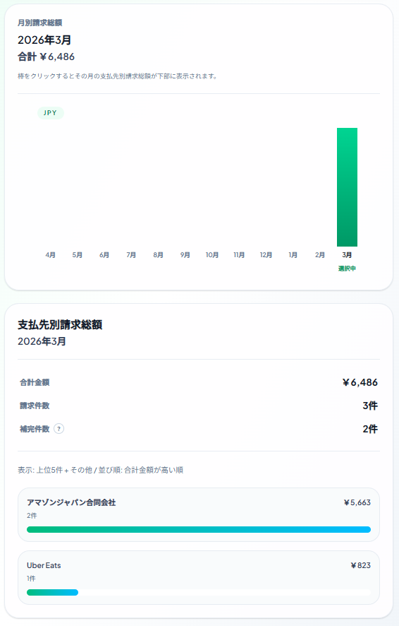
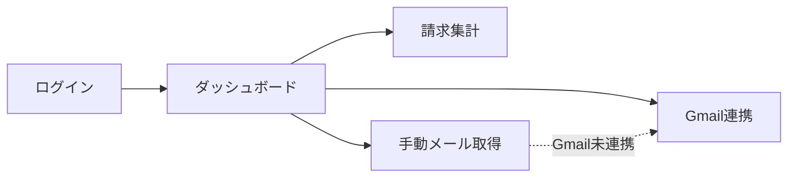

# billingrse とは

Gmailから取得した請求メールをもとに、AI解析結果の確認、請求の検索・集計、メール連携の管理を行えるWebアプリです。  
※本リポジトリは`billingrse`の`フロントエンド`です  
バックエンドが収集・解析した請求データを、ユーザーが扱いやすい形で可視化し、確認・再実行・集計のソリューションを提供します

- 認証から各業務画面までの導線を提供
- Gmail連携、手動メール取得、請求集計をUIとして実装
- API連携、状態管理、エラーハンドリングを整理した構成

## このプロジェクトが解く課題

本プロジェクトは下記課題を解決し、
複数メールサービス・複数アカウントの請求メールを集計・確認するソリューションを提供します。

- SaaS や各種支払いに関するメールは受信箱に散在しやすく、あとから検索・集計・重複確認しづらい
- 複数メールサービス・複数アカウントにまたがって情報を集約するのが難しい
- メール本文は非構造データなので、そのままでは請求一覧や月次比較に使いづらい
- AI 解析だけでは業務データとして不十分で、支払先の正規化、請求成立判定、監査可能な履歴設計が別途必要になる

## 主要ユースケース

1. アカウント登録・メール認証
2. Gmailアカウント連携
3. 手動メール取得実行
4. 手動メール取得の実行履歴にて請求の解析状況確認
5. 請求の年/月推移・月次集計

### Gmailアカウント連携

OAuth2 で Gmail と接続し、対象メール取得の準備を行う  


### 手動メール取得実行

対象条件に応じて`workflow`を起動する  


### 連携履歴一覧

実行した`workflow`の進捗状況を監査可能にする  


### 連携履歴詳細

実行した`workflow`の各Stageの処理状況・失敗件数とその理由を監査可能にする  


### 年/月推移・月次集計

請求を年/月推移・月次単位で確認可能  


## 画面構成

全体の画面構成は次のとおりです。詳細は[画面設計一覧](./docs/spec/README.md)を参照してください。



## ディレクトリ構成

フロントエンドは `app / features / shared` を軸に責務を分けています。詳細は[アーキテクチャ](./docs/architecture.md)を参照してください。

```txt
project root / src
├── app           アプリ全体の骨格
│   ├── router    画面URL、リダイレクト、route guard
│   ├── layouts   共通レイアウト
│   ├── providers Provider 定義
│   └── styles    グローバルスタイル
├── features      業務機能ごとの実装
│   ├── {feature}
│   │   ├── screens    画面入口
│   │   ├── components feature 固有 UI
│   │   ├── hooks      画面ロジック / server state
│   │   ├── api        バックエンド通信
│   │   ├── schema     バリデーション
│   │   ├── types      型定義
│   │   └── lib        補助処理
├── shared        複数 feature で再利用する共通処理
│   ├── api       共通 API クライアント / HTTP 処理
│   ├── auth      認証トークン管理 / 認証補助処理
│   ├── ui        共通 UI コンポーネント
│   └── lib       業務知識を持たない共通関数
└── test          画面横断のテスト
```

## 技術スタック

採用技術と各ライブラリの役割は[技術構成（スタック）](./docs/technology_stack.md)にまとめています。

## 設計上の工夫

- `app / features / shared` を軸に責務を分離し、画面導線、業務機能、共通基盤が混ざらない構成にしています。
- `shared/api` に共通 API クライアントを置き、認証ヘッダ付与、エラー整形、401 発生時の再認証と再試行を集約しています。
- `AuthGuard / GuestGuard` を用いて、公開画面と認証必須画面の遷移制御を統一しています。
- server state は TanStack Query、フォーム入力は React Hook Form + Zod、画面内で閉じる状態は React の local state として責務を分けています。

## 実装で重視したこと

- Gmail 連携、手動メール取得、請求集計のような業務フローを、画面遷移だけで迷わず辿れる導線にすることを重視しました。
- 読み込み中、取得失敗、再試行、未認証時の再ログイン誘導を画面ごとに明示し、API エラー時でも状態が分かる UI にしています。
- AI 解析や workflow 実行のような非同期処理は、履歴一覧や詳細画面から進捗と失敗理由を追えるようにしています。

## テストと品質担保

- `Vitest` と `React Testing Library` を用いて、主要画面、フォーム、ルーティング、hooks の振る舞いをテストしています。
- 会員登録やメール認証では、入力バリデーション、成功時の遷移、API エラー時の表示まで確認しています。
- 請求集計や Gmail 連携、手動メール取得では、表示切り替え、再取得、エラー時ハンドリングなど業務画面の振る舞いを確認しています。
- `shared/api` や認証トークン処理のテストも用意し、画面層だけでなく共通基盤の挙動も検証しています。

## 詳細ドキュメント

- ドキュメント一覧: [docs](./docs)
- ローカル環境構築手順: [docs/VsCodeDevContainer.md](./docs/VsCodeDevContainer.md)
- アーキテクチャ: [docs/architecture.md](./docs/architecture.md)
- 技術スタック: [docs/technology_stack.md](./docs/technology_stack.md)
- コーディングルール: [docs/coding_rules.md](./docs/coding_rules.md)
- デザインガイドライン: [docs/design_guidelines.md](./docs/design_guidelines.md)
- 画面設計一覧: [docs/spec/README.md](./docs/spec/README.md)
- バックエンド: [billingrse_backend](https://github.com/shrimptails-f/billingrse_backend)
