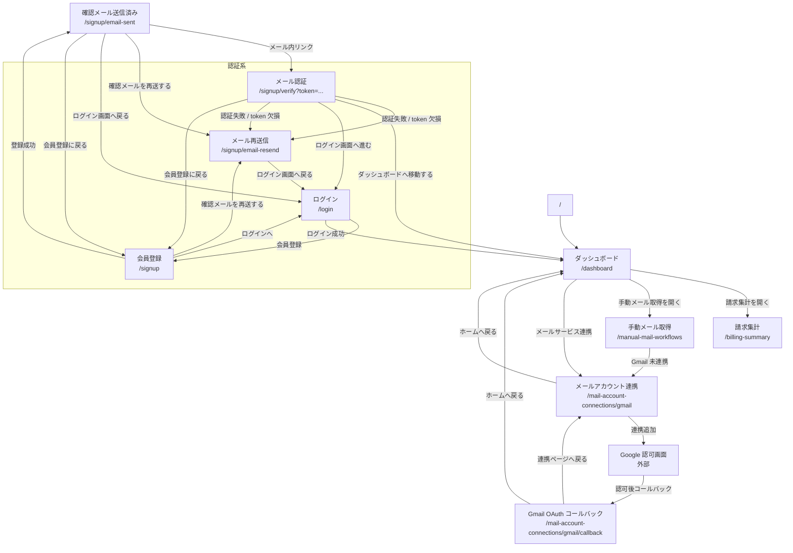

# 画面設計一覧

| 画面名                                                           | URL                                         | 概要                                                                                                     |
| ---------------------------------------------------------------- | ------------------------------------------- | -------------------------------------------------------------------------------------------------------- |
| [ログイン画面](./login/README.md)                                | `/login`                                    | 登録済みユーザーがメールアドレスとパスワードで認証し、業務画面へ遷移するための入口画面。                 |
| [会員登録画面](./signup/README.md)                               | `/signup`                                   | 未登録ユーザーが氏名、メールアドレス、パスワードを入力して仮登録を行い、確認メール送信フローへ進む画面。 |
| [メール再送信画面](./resend-email/README.md)                     | `/signup/email-resend`                      | 会員登録済みメールアドレスとパスワードを使って確認メールを再送し、結果を同画面で確認する画面。           |
| [メール認証画面](./verify-email/README.md)                       | `/signup/verify?token=<verification-token>` | 確認メールのトークンでメールアドレス認証を実行し、成功・失敗に応じた次の導線を案内する画面。             |
| [メールアカウント連携画面](./mail-account-connections/README.md) | `/mail-account-connections/gmail`           | Gmail アカウントの連携追加、連携済み一覧の確認、不要な連携の解除を行う管理画面。                         |
| [手動メール取得画面](./manual-mail-workflows/README.md)          | `/manual-mail-workflows`                    | 条件を指定して手動メール取得ワークフローを開始し、実行履歴やステージ詳細を確認する画面。                 |
| [請求集計画面](./billing-summary/README.md)                      | `/billing-summary`                          | 直近 12 ヶ月の請求推移と、選択月の支払先別請求内訳を集計ビューで確認する画面。                           |

## 画面遷移図

以下は `src/app/router/route.tsx` と各画面仕様書をもとに整理した画面遷移図です。一覧表外の関連画面として、`/signup/email-sent` と `/mail-account-connections/gmail/callback` も含めています。

### 補足

- `/signup` は `GuestGuard` 配下のため、認証済みユーザーが到達した場合は `/dashboard` へ遷移する
- `/dashboard`、`/billing-summary`、`/manual-mail-workflows`、`/mail-account-connections/gmail`、`/mail-account-connections/gmail/callback` は `AuthGuard` 配下のため、未認証時は `/login` へ遷移する
- 保護画面は `DashboardLayout` 共通ヘッダーから `/dashboard` への戻り導線とログアウト導線を持つ
- `/` と未定義 path は `/dashboard` 起点に正規化される
